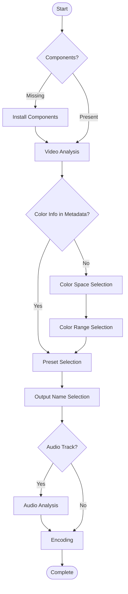

# o3Enc

o3Enc is a Python based tool for video encoding using FFmpeg.

## Requirements

- Windows 10+ (PowerShell)
- Python
- NVIDIA GPU (for default presets)

## Installation

1. Extract the downloaded archive to your desired location
2. Run `o3Enc.bat` - Required components will be automatically installed in the o3enc/bin/ directory when you first run it

## Usage

Either:
- Drag and drop a video file onto `o3Enc.bat`
- Run `o3Enc.bat <video file>`

## Presets Usage

Presets are defined in `presets.ini` with the following format:

```
[example_preset_name]
2pass=           # Use two-pass encoding (true/false)
hwaccel=         # Hardware acceleration (cuda, none, etc.)
encoder=         # Encoder
container=       # Container format
height=          # Output height (width is automatically calculated)
fps=             # Frame rate (space = same as input)
pixfmt=          # Pixel format (space = auto)
scale_flags=     # Scaling algorithm (If you use scaling)
options=         # FFmpeg encoding options (For advanced users)
audio_codec=     # Audio codec
audio_bitrate=   # Audio bitrate
target_lufs=     # Audio normalization target (Integrated Loudness)
target_lra=      # Target Loudness Range (LU, lower = more consistent volume)
target_tp=       # True Peak target (dB, prevents clipping)
```

- Sample1 (H.264 with NVENC)
```
[Basic-H264]
2pass=true
hwaccel=cuda
encoder=h264_nvenc
container=mp4
height=
fps=
pixfmt=yuv420p
scale_flags=
options=-preset p6 -b:v 10000k -maxrate:v 10000k -bufsize:v 20000k -bf 2 -refs 16 -b_ref_mode each
audio_codec=aac
audio_bitrate=128k
target_lufs=-18
target_lra=7
target_tp=-2
```

- Sample2 (AV1-1080p30fps)
```
[AV1]
2pass=false
hwaccel=
encoder=libaom-av1
container=webm
height=1080
fps=30
pixfmt=yuv420p
scale_flags=lanczos
options=-cpu-used 4 -b:v 8000k -maxrate:v 16000k -bufsize:v 16000k -row-mt 1 -tiles 1x1 -strict experimental -lag-in-frames 35 -aq-mode 1
audio_codec=libopus
audio_bitrate=128k
target_lufs=-18
target_lra=7
target_tp=-2
```

## Included Presets

- H.264 presets for basic use
- H.264/HEVC presets for High-Quality Archiving
- VP9 and AV1
- Optimized presets for specific platforms (X, iwara.tv)

## Flow



## License

Unlicense

- FFmpeg official site: https://ffmpeg.org/
- gyan.dev (Windows builds): https://www.gyan.dev/ffmpeg/builds/

The FFmpeg binary is NOT included in this repository/release package and will be downloaded during the first run.