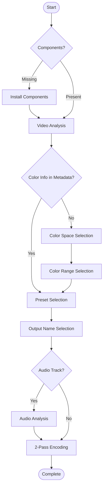

# o3Enc

o3Enc is a Python based tool for video encoding using FFmpeg, with CUDA acceleration and customizable presets.

## Requirements

- Python
- Windows 10 or later
- NVIDIA GPU (for default presets)

## Installation

1. Extract the downloaded archive to your desired location
2. Run `o3Enc.bat` - required components will be automatically installed on first run

## Usage

Either:
- Drag and drop a video file onto `o3Enc.bat`
- Run `o3Enc.bat <video file>`

## Flow

## Included Presets

- H.264 presets for basic use
- H.264/HEVC presets for High-Quality Archiving
- Optimized presets for specific platforms (iwara.tv)

## License

CC0

- FFmpeg official site: https://ffmpeg.org/
- gyan.dev (Windows builds): https://www.gyan.dev/ffmpeg/builds/

The FFmpeg binary is NOT included in this repository/release package and will be downloaded during the first run.